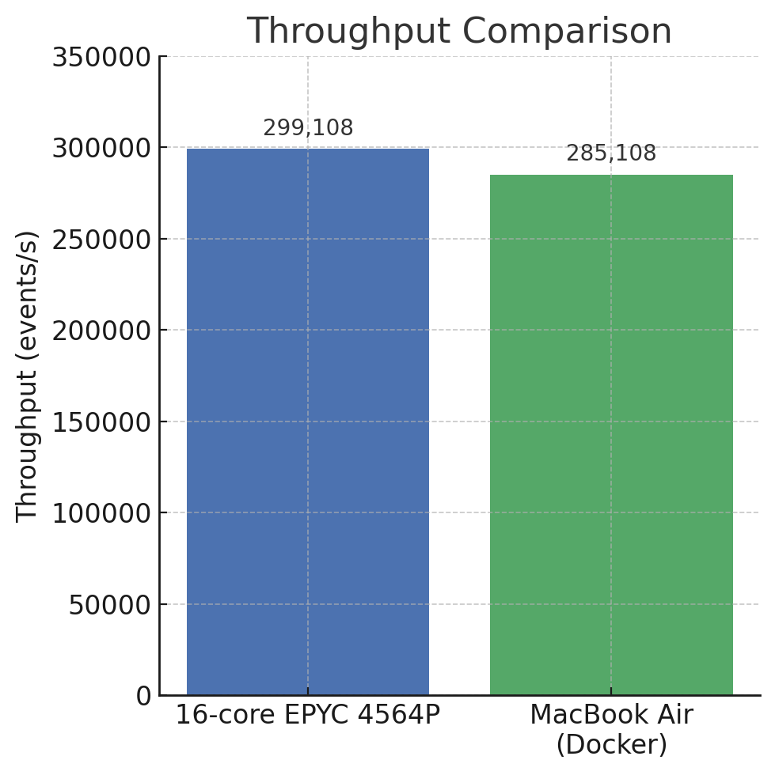
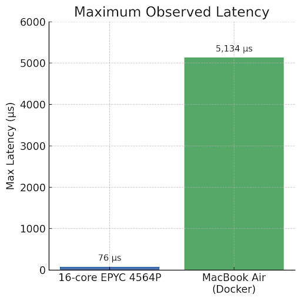

# HFT Exchange Benchmark Report

## Overview

This report compares the performance of a custom high-frequency trading (HFT) exchange simulator on two different machines: a **MacBook Air (Docker container)** and a **16-core AMD EPYC 4564P server**. The system under test is a custom-built exchange simulator with an in-memory order book supporting order additions, modifications, cancellations, and trade matching. Both environments processed an identical sequence of ~510k order events (replayed from IEX DEEP+ market data logs) to evaluate latency and throughput. Key performance metrics (per-event latency distribution and total throughput) were measured and are presented below. The goal is to assess how a laptop-class machine compares to a server-grade processor for this HFT workload, and to discuss expected benefits of scaling to even higher core counts.

## Architecture Summary

- **Order Book Structure:** Each instrument’s order book maintains two sorted maps (`bids_`, `asks_`) backed by `plf::hive` containers, which provide efficient memory management and stable iterators for fast inserts, deletes, and order matching.
- **Isolated Ticker Threads:** The system spawns one dedicated thread per ticker symbol. Each order book runs on its own thread, ensuring that order matching for different tickers occurs in parallel without lock contention between books.
- **Lock-Free Message Queues:** Incoming order messages (parsed from the log feed) are dispatched to the appropriate order book thread via lock-free concurrent queues. This minimizes synchronization overhead when handing off messages to the matching engine threads.
- **Structured Logging:** All significant events—price level updates, trades, cancellations—are logged in a structured format. This logging provides traceability and debugging insight, though it introduces some I/O overhead.
- **Replay of Real Market Data:** The workload is a replay of IEX **DEEP+** message logs, providing realistic market behavior with a mix of order additions, modifications, and cancellations. This ensures the performance measurements reflect a real-world HFT scenario.

## Benchmark Results

The HFT system was benchmarked on the two platforms under identical conditions, processing a total of 509,736 events in each run. The MacBook Air test was run inside a Docker container (on macOS), whereas the AMD EPYC test ran on a dedicated Linux server. Both runs produced comprehensive latency statistics and throughput measurements, summarized below.

**Performance Metrics:**

| Metric                      | AMD EPYC 4564P (16-core server) | MacBook Air (Docker container) |
|-----------------------------|-------------------------------:|-------------------------------:|
| Events Processed            |                          509,736 |                        509,736 |
| Wall-Clock Time (s)         |                            1.704 |                          1.788 |
| **Throughput (events/s)**   |                        **299,108** |                      **285,108** |
| Avg Latency per Event (μs)  |                           3.185 |                           3.330 |
| Min / Max Latency (μs)      |                         0 / 76  |                   0 / **5,134** |
| 95th Percentile Latency     |                               3 |                               3 |

  

<em>Figure 1: The EPYC server processes slightly more events per second than the MacBook Air.</em>

  

<em>Figure 2: The MacBook Air experienced a one-time latency spike of over 5ms, whereas the server stayed under 100μs.</em>

## Analysis

**Throughput and Latency Comparison:**  
The 16-core AMD EPYC system achieved slightly better throughput and nearly identical average latency when compared to the MacBook Air. The ~5% throughput gain on EPYC can be attributed to its higher per-core performance and the absence of virtualization overhead.

Despite these differences, the MacBook Air’s performance was impressively close in terms of average latency and throughput, demonstrating that the exchange simulator is highly efficient.

The primary performance differentiator was **latency consistency**. The EPYC server provided much more predictable latency, as evidenced by its low maximum latency. The MacBook Air’s single 5 ms outlier could be due to OS scheduling, Docker overhead, or CPU throttling.

In a real HFT context, these occasional latency spikes on a consumer machine could be problematic, underscoring why dedicated server hardware is preferred for production.

**Resource Utilization:**  
The EPYC server, with more cores, has greater headroom for ticker threads or higher throughput. The MacBook would likely saturate earlier under load.

## High-Core Scaling (Future Work)

While we intended to benchmark on a 96-core machine, **we did not have access to one**. A 96-core CPU could process more tickers in parallel and isolate real-time threads better from background noise.

However, we expect **diminishing returns beyond a certain point** unless there’s sufficient ticker parallelism in the event stream.

## Conclusion

The HFT simulator demonstrated **microsecond-level performance** on both platforms. The server-grade EPYC CPU had a slight edge in throughput and showed **better latency consistency**.

Although the MacBook Air handled the workload well in most cases, the occasional spike makes it less reliable for production-level latency-sensitive trading systems.

For production HFT, server-class hardware is strongly recommended.

# Testing Latency & Throughput of Multithreaded Exchange in C++ on Different Architectures

  

**Ratik Iyer, QR**

Hi, I'm Ratik, a sophomore at the University of Illinois Urbana-Champaign studying Computer Science, Statistics, and Math. I am passionate about quantitative trading, machine learning, and high-performance computing. My primary languages are C++ and Python. I am currently seeking internship opportunities for quantitative research and trading roles are hedge funds, prop shops, and market makers. 

Email: ratiki2@illinois.edu  
LinkedIn: [https://www.linkedin.com/in/ratik-iyer-57058b17a/](https://www.linkedin.com/in/ratik-iyer-57058b17a/)  
Github: [https://github.com/ratikiyer](https://github.com/ratikiyer)

  

**Kevin Xu, SWE**

Hello, I am a sophomore studying Statistics + Computer Science. I am interested in statistical modeling, software engineering, and high frequency trading technology development. I am proficient in Python, C++, and C# and am interested in any opportunities for Summer 2026. 

Email: khx2@illinois.edu  
LinkedIn: [https://www.linkedin.com/in/kevinxu501/](https://www.linkedin.com/in/kevinxu501/)

  

**Sidd Cheetancheri, SWE**

Hello, I am a sophomore studying Computer Science at UIUC. I am interested in machine learning (particularly transformer models) and computer networking. I am proficient in C++, Python, and C. I am interested in opportunities involving ML optimization or network solutions for Summer 2026.

Email: siddc2@illinois.edu  
LinkedIn: [https://www.linkedin.com/in/sidd-cheetancheri/](https://www.linkedin.com/in/sidd-cheetancheri/)

  

**Anuraag Aravindan, SWE**

Hello, I am a sophomore studying Computer Science and Economics at UIUC. I am interested in quantitative trading, statistical modeling, and machine learning. I am proficient in Python, and C++. I am interested in opportunties as a trader at options market makers and hedge funds for both low and high touch desks. I am interested in any summer 2026 opportunities.

Email: anuraag6@illinois.edu  
LinkedIn: [https://www.linkedin.com/in/anuraag-aravindan/](https://www.linkedin.com/in/anuraag-aravindan/)

